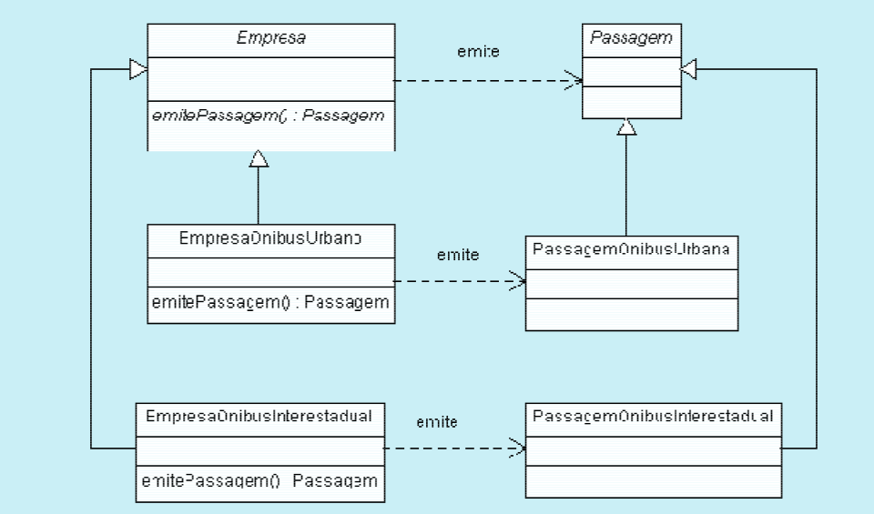

# Padrões de Projeto GoF (Design Patterns)

#### 1 - SINGLETON 

- **Intenção**: garantir que uma determinada classe tenha uma, e somente uma instância, mantendo um ponto global de acesso para a mesma.

#### 2 - FACTORY METHOD

- **Intenção**: definir uma inerface para criar um objeto, mas deixar as subclasses decidirem que classes instaciar.
- Criar uma instância de várias classes derivadas

